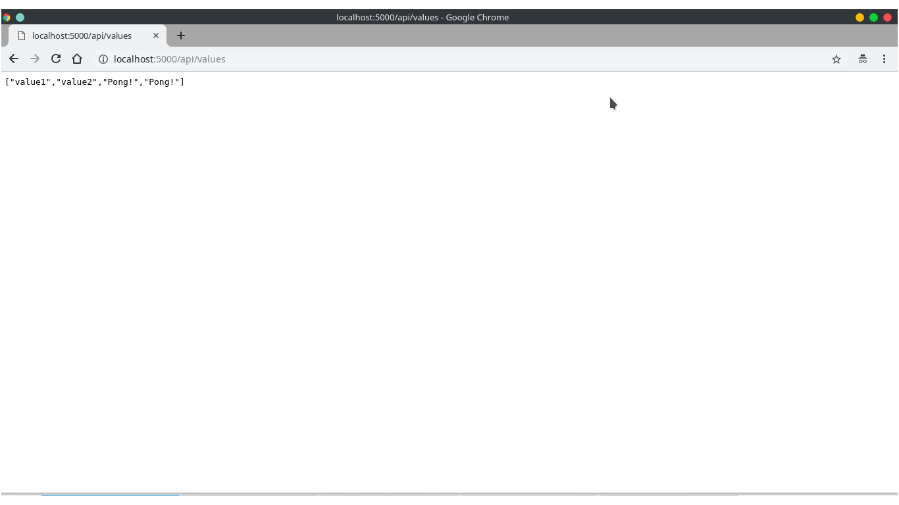

# Example of a simple web API using Oragon.Spring

<!-- TOC -->

- [Example of a simple web API using Oragon.Spring](#example-of-a-simple-web-api-using-oragonspring)
	- [1. Build the application](#1-build-the-application)
		- [1.1 Run local (debug mode)](#11-run-local-debug-mode)
			- [Test the app](#test-the-app)
			- [In browser result](#in-browser-result)
	- [2. Run in docker](#2-run-in-docker)
		- [2.1 Install Docker for your plataform](#21-install-docker-for-your-plataform)
	- [3. Run the application](#3-run-the-application)

<!-- /TOC -->

## 1. Build the application
### 1.1 Run local (debug mode)
- Type these commands in your shell
```shell
$ cd path/to/root/of/oragon
$ cd Oragon.Spring.Core.AspNetCoreTest
$ dotnet run 
```
#### Test the app
- Open the [http://localhost:5000/api/values](http://localhost:5000/api/values) inyour browser;
Or type these command in your shell
```shell
$ curl --request GET --url http://localhost:5000/api/values --header 'cache-control: no-cache'
```
- Result
```shell
["value1","value2","Pong!","Pong!"]
```
#### In browser result


## 2. Run in docker
### 2.1 Install Docker for your plataform
 - [Install docker instructions](https://www.docker.com/community-edition)

## 3. Run the application

```shell
$ cd path/to/root/of/oragon
$ cd Oragon.Spring.Core.AspNetCoreTest
$ # build docker and image locally 
$ docker build -t oragon.aspnetcoreteste:alpine -f Oragon.Spring.Core.AspNetCoreTest/Dockerfile.alpine .
$ # run the docker image create above
$ docker run --rm -d -p 8080:80 oragon.aspnetcoreteste:alpine
$ # test again the container in the port 8080
$ curl --request GET --url http://localhost:8080/api/values --header 'cache-control: no-cache'
```
- Result
```shell
["value1","value2","Pong!","Pong!"]
```